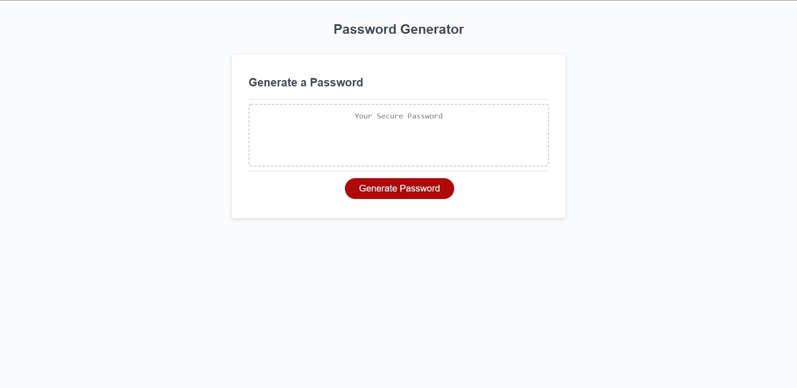

# Third Challenge (Password Generator)

## Project Description
This is the third coding challenge for the UT Austin coding bootcamp. The main objective of this project was to use Javascript to build a password generator. The HTML and CSS were provided for us along with some basic starter code for Javascript.

## How to Use This Project
    1) Open the webpage (https://adamwagh512.github.io/password-generator/)
    2) Click on the "Generate Password" button 
    3) Set the criteria for your new password by following the prompts on the screen
    4) Enjoy your brand new super secure password! 
    5) Copy and paste your new password (optional) 

## Credits
I claim no ownership over the HTML, CSS or lines 1-14 of the JavaScript code. This was provided as part of the assignment and did not alter it in any way. 

Alert message - https://www.w3schools.com/jsref/tryit.asp?filename=tryjsref_alert

JavaScript array concat: https://www.w3schools.com/jsref/jsref_concat_array.asp

empty array = https://www.quora.com/How-do-you-declare-an-empty-array-in-JavaScript

Math.Random =https://www.w3schools.com/jsref/jsref_random.asp

Get random item from array - https://www.w3resource.com/javascript-exercises/javascript-array-exercise-35.php

Special Thanks to Jon at the helpdesk who went above and beyond to help me with the randomSelector function, as well as finishing out my project. You are the best Jon!

## License
MIT License

Copyright (c) 2022 adamwagh512

Permission is hereby granted, free of charge, to any person obtaining a copy
of this software and associated documentation files (the "Software"), to deal
in the Software without restriction, including without limitation the rights
to use, copy, modify, merge, publish, distribute, sublicense, and/or sell
copies of the Software, and to permit persons to whom the Software is
furnished to do so, subject to the following conditions:

The above copyright notice and this permission notice shall be included in all
copies or substantial portions of the Software.

THE SOFTWARE IS PROVIDED "AS IS", WITHOUT WARRANTY OF ANY KIND, EXPRESS OR
IMPLIED, INCLUDING BUT NOT LIMITED TO THE WARRANTIES OF MERCHANTABILITY,
FITNESS FOR A PARTICULAR PURPOSE AND NONINFRINGEMENT. IN NO EVENT SHALL THE
AUTHORS OR COPYRIGHT HOLDERS BE LIABLE FOR ANY CLAIM, DAMAGES OR OTHER
LIABILITY, WHETHER IN AN ACTION OF CONTRACT, TORT OR OTHERWISE, ARISING FROM,
OUT OF OR IN CONNECTION WITH THE SOFTWARE OR THE USE OR OTHER DEALINGS IN THE SOFTWARE.

